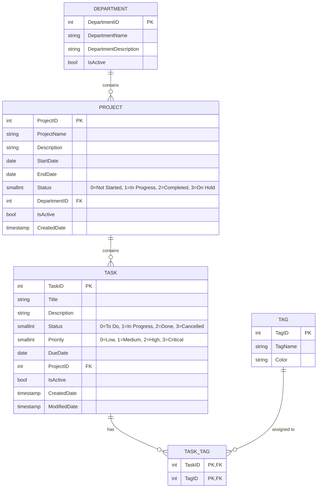

# PRN232 Assignment 1 — Task & Team Management Web Application

> **Student ID**: QE180136  
> **Student Name**: Nguyen Van Phu (PhuNVQE180136)  
> **Course Code**: PRN232 - Assignment 1 of 2  
> **Tech Stack**: ASP.NET Core Web API (.NET 8) | PostgreSQL | Next.js 14 (TypeScript) | Tailwind CSS | Lucide React  
> **Target Grade**: 10.0 / 10.0 (Including all Core & Bonus Features)

---

## 🔗 Live Deployment & Project Links

| Service | Description | URL / Link |
|---|---|---|
| 🌐 **Frontend Web App** | Next.js 14 App Router on Vercel | [https://taskminder-qe180136.vercel.app](https://taskminder-qe180136.vercel.app) |
| 🔌 **Backend API / Swagger** | .NET 8 Web API on Render.com | [https://tasktrack-api-qe180136.onrender.com/swagger](https://tasktrack-api-qe180136.onrender.com/swagger) |
| 🐙 **GitHub Repository** | Source code & Version control | [https://github.com/phunvqe180136/AS1_PRN232_Fa26](https://github.com/phunvqe180136/AS1_PRN232_Fa26) |
| 🗄️ **Database Script** | PostgreSQL Schema & Seed Data | [`TaskManagementDB_Postgres.sql`](./TaskManagementDB_Postgres.sql) |
| 📘 **Deploy Instructions** | Step-by-step Deploy Guide (Render + Vercel) | [`DEPLOY_GUIDE.md`](./DEPLOY_GUIDE.md) |
| 📗 **Supabase Guide** | Cloud Database Setup Guide | [`SUPABASE_SETUP.md`](./SUPABASE_SETUP.md) |

---

## 📊 1. Entity Relationship Diagram (ERD)



---

## 🏗️ 2. Solution Architecture

```
AS1_PRN232_Fa26/
├── .github/
│   └── workflows/
│       └── ci.yml                      # [BONUS] Automated CI/CD Build & Lint Check
│
├── QE180136_PRN232_Ass1_BE/            # Backend Solution (.NET 8 Web API)
│   ├── QE180136_PRN232_Ass1_BE.sln     # Standard Solution File
│   ├── Dockerfile                      # Multi-stage production container build
│   ├── render.yaml                     # Render infrastructure-as-code
│   ├── TaskTrack.API/                  # Controllers, Swagger, Program.cs, CORS
│   │   ├── Controllers/
│   │   │   ├── DepartmentsController.cs
│   │   │   ├── ProjectsController.cs
│   │   │   ├── TasksController.cs
│   │   │   ├── TagsController.cs
│   │   │   └── StatsController.cs
│   │   ├── appsettings.json
│   │   └── Program.cs
│   ├── TaskTrack.Repo/                 # EF Core DbContext, Repositories, Models
│   │   ├── Models/                     # Scaffolded DB Models
│   │   ├── Repositories/               # Repository interfaces & implementations
│   │   └── TaskTrackDbContext.cs
│   └── TaskTrack.Service/              # DTOs, Business Logic & Service Interfaces
│       ├── DTOs/
│       ├── Interfaces/
│       └── Implementations/
│
├── QE180136_PRN232_Ass1_FE/            # Frontend (Next.js 14 App Router + TS)
│   ├── app/
│   │   ├── page.tsx                    # TaskMinder Dashboard (Progress Cards, Kanban, Donut Activity)
│   │   ├── departments/                # Public Departments & [id] Detail
│   │   ├── departments/manage/         # Department CRUD + Modals
│   │   ├── projects/                   # Public Projects & [id] Detail (with Tasks)
│   │   ├── projects/manage/            # Project CRUD + Modals
│   │   ├── tasks/                      # Public Tasks + [BONUS] Status Filter Tabs
│   │   ├── tasks/[id]/                 # Task Details with Tags & Timestamps
│   │   ├── tasks/manage/               # Task CRUD + Multi-select Tags + Soft Delete
│   │   ├── tags/manage/                # Tag CRUD + Color Badges & Presets
│   │   └── search/                     # Advanced Multi-field Task Filter (Omni Search)
│   ├── components/                     # Sidebar, Header, Badges, Modals, States, Toast
│   └── lib/                            # API Client, Services, Types, Enums
│
├── TaskManagementDB_Postgres.sql       # PostgreSQL Initial Script & Seed Data
├── DEPLOY_GUIDE.md                     # Deployment Guide (Render + Vercel + Postgres)
└── SUPABASE_SETUP.md                   # Supabase Database Guide
```

---

## 🌐 3. API Endpoints Specification

All endpoints are **public** (no authentication required) and comply with assignment constraints:

### Departments (`/api/departments`)
- `GET /api/departments` — List active departments (with project count)
- `GET /api/departments/{id}` — Get single department and its linked projects
- `POST /api/departments` — Create new department (validated)
- `PUT /api/departments/{id}` — Update department
- `DELETE /api/departments/{id}` — Delete department (400 if projects linked)
- `GET /api/departments/search?name=` — Partial name search

### Projects (`/api/projects`)
- `GET /api/projects` — List active projects with department name
- `GET /api/projects/{id}` — Get single project and its linked tasks
- `GET /api/projects/department/{departmentId}` — List projects in department
- `POST /api/projects` — Create project (validated)
- `PUT /api/projects/{id}` — Update project
- `DELETE /api/projects/{id}` — Delete project (400 if tasks linked)
- `GET /api/projects/search?name=&status=&departmentId=` — Multi-parameter project filter

### Tasks (`/api/tasks`)
- `GET /api/tasks` — List active tasks with tags
- `GET /api/tasks/{id}` — Get single task including tags
- `GET /api/tasks/project/{projectId}` — List tasks under project
- `POST /api/tasks` — Create task (optional `tagIds` array)
- `PUT /api/tasks/{id}` — Update task, replace tags, update `modifiedDate`
- `DELETE /api/tasks/{id}` — Soft-delete task (`isActive = false`)
- `GET /api/tasks/search?title=&status=&priority=&projectId=&tagId=` — Filter tasks

### Tags (`/api/tags`)
- `GET /api/tags` — List all tags
- `POST /api/tags` — Create new tag with HEX color
- `PUT /api/tags/{id}` — Update tag
- `DELETE /api/tags/{id}` — Delete tag (400 if assigned to any task)

### Stats (`/api/stats/summary`)
- `GET /api/stats/summary` — Aggregate summary counts for Home dashboard

---

## 🌟 4. Bonus Features Included
1. **Status Filter on Task List Page (`/tasks`)**: Filter tasks interactively by status (*All*, *To Do*, *In Progress*, *Done*, *Cancelled*).
2. **GitHub Actions CI Check (`.github/workflows/ci.yml`)**: Automated compilation & lint checks on push for both Backend and Frontend.
3. **ERD Diagram**: Full Mermaid Entity-Relationship diagram included in README.
4. **TaskMinder SaaS Redesign**: High-end modern UI with sidebar navigation, project progress bars, kanban columns, and SVG donut task activity chart.

---

## 🚀 5. Local Setup & Running

### Backend
```bash
cd QE180136_PRN232_Ass1_BE
dotnet restore
dotnet run --project TaskTrack.API
# Swagger UI available at: http://localhost:5000/swagger
```

### Frontend
```bash
cd QE180136_PRN232_Ass1_FE
npm install
npm run dev
# Web application available at: http://localhost:3000
```
